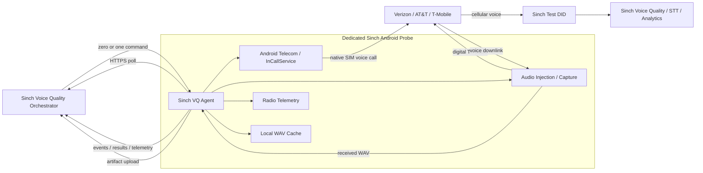
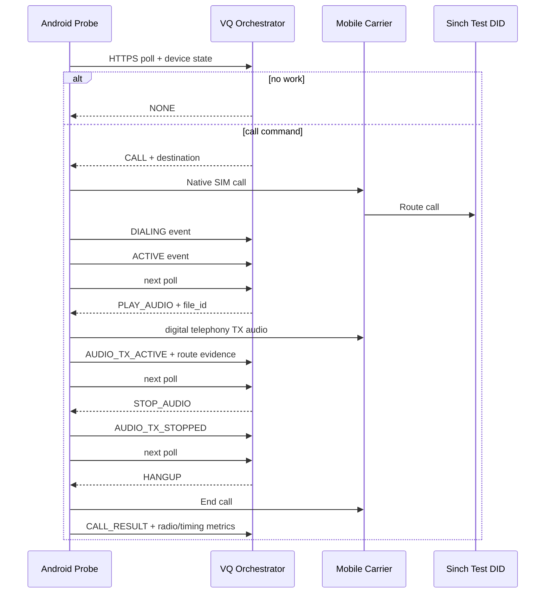

# Sinch Mobile Voice Quality Probe v0.2.1

## Overview

Sinch Mobile Voice Quality Probe is an engineering proof of concept that turns a dedicated Android handset into a remotely controlled native mobile voice-quality probe.

The phone uses a real carrier SIM and originates native cellular voice calls through the handset's normal carrier voice stack. The phone does **not** contain test scenarios, schedules, number lists, retry policies, or business logic. Those remain centralized in the external Sinch Voice Quality Orchestrator.

The Android application is intentionally designed as a lightweight execution agent.

Version 0.2.1 preserves the Phase A functionality and adds the first privileged Phase B implementation for digital in-call TX audio injection and cellular downlink capture on a Google Pixel 5 / `redfin`.

---

## Primary Phase B Target

The first hardware validation target is:

- **Device:** Google Pixel 5
- **US model:** GD1YQ
- **Codename:** `redfin`
- **OS:** Stock Google Android 14
- **Preferred build:** `UP1A.231105.001.B2`
- **Bootloader:** Unlockable / unlocked for the engineering device
- **Root:** Magisk 30.7
- **First carrier:** Verizon US with a voice-enabled SIM

This is a dedicated Sinch-owned engineering device.

The design intentionally preserves:

- Google Android userspace
- Google carrier configuration
- Qualcomm modem firmware
- vendor Audio HAL
- OEM IMS implementation
- native carrier voice behavior

Do **not** install LineageOS, GrapheneOS, or another custom ROM for the primary validation target.

---

## What v0.2.1 Includes

| Area | v0.2.1 behavior |
|---|---|
| Android | Kotlin, Android 10+ / API 29 minimum, target API 35 |
| Phone integration | Default dialer role and `InCallService` |
| Control | Enrollment, renewable credentials, outbound HTTPS polling |
| Native calling | Explicit SIM/phone-account selection; one probe call at a time |
| Call state | Dialing, active, disconnected, timestamps and final result |
| Radio telemetry | Best-effort SIM, service, RAT, cell and signal measurements |
| File handling | HTTPS download, SHA-256 verification, private cache and delete |
| Agent operation | Foreground service, reconnect/backoff and boot recovery |
| Reference orchestrator | Python standard library, SQLite, TLS and CLI control |
| Experimental TX | Privileged `AudioTrack` routed toward observed `TYPE_TELEPHONY` |
| Experimental RX | Privileged voice-source `AudioRecord` and WAV creation |
| Pixel 5 validation | `DIGITAL_TX_VALIDATION`, route evidence and vendor-policy collection |
| Evidence tooling | Permission checks, device dumps, marker generation and waveform analysis |

Current status:

- APK builds successfully
- lint passes
- automated tests pass
- Phase A remains functional
- experimental TX/RX code exists
- **real Verizon VoLTE TX audio delivery has not yet been proven**
- **real cellular downlink capture has not yet been proven**

A successful build does not prove Phase B.

Physical Phase B success requires:

1. a known reference WAV to be received at the far end while the handset microphone is muted; and
2. known far-end audio to be captured into a valid WAV file from the handset cellular downlink.

---

# System Architecture



---

# Operating Model

The orchestrator is the **brain**.

The Android phone is the **executor**.

The orchestrator owns:

- test scenarios
- schedules
- destination-number lists
- call ordering
- retries
- wait timers
- test correlation
- carrier selection
- expected media
- pass/fail logic
- Voice Quality analytics integration

The Android agent owns only device-local execution:

- poll the orchestrator
- report current device state
- execute one command
- place or terminate a native cellular call
- download/delete WAV files
- inject digital audio
- record cellular downlink audio
- collect radio/device measurements
- return events, results, logs and artifacts

The phone does not need a public IP address and does not accept inbound HTTP webhooks. All control is initiated by the phone over outbound HTTPS.

---

# Orchestrator-to-Phone Flow



The same command model is used for downlink recording:

```text
CALL
  ↓
wait for ACTIVE
  ↓
START_RECORDING direction=DOWNLINK
  ↓
far end plays known reference audio
  ↓
STOP_RECORDING
  ↓
UPLOAD_FILE
  ↓
HANGUP
```

The orchestrator always decides what comes next.

---

# Core Command Model

Typical commands include:

- `DOWNLOAD_FILE`
- `DELETE_FILE`
- `CALL`
- `HANGUP`
- `GET_STATUS`
- `GET_RADIO_STATS`
- `PLAY_AUDIO`
- `STOP_AUDIO`
- `START_RECORDING`
- `STOP_RECORDING`
- `UPLOAD_FILE`
- `GET_AUDIO_STATUS`
- `GET_AUDIO_DIAGNOSTICS`
- `REBOOT_APP`

Each command has a unique `command_id`.

Commands should be idempotent where practical so a duplicate poll or lost network response does not accidentally originate a duplicate call.

Illustrative command:

```json
{
  "command_id": "cmd-1001",
  "action": "CALL",
  "parameters": {
    "number": "+12165551212"
  }
}
```

Illustrative result:

```json
{
  "command_id": "cmd-1001",
  "status": "SUCCESS",
  "data": {
    "state": "ACTIVE"
  }
}
```

For audio commands, requested and actual routing must be reported separately.

A request for `TYPE_TELEPHONY` must **not** be reported as successful if Android actually routes playback elsewhere.

---

# Phase B TX Path

```text
reference.wav
      ↓
Sinch VQ Agent
      ↓
AudioTrack
      ↓
TYPE_TELEPHONY
      ↓
incall_music_uplink / telephony output path
      ↓
Telephony TX
      ↓
Qualcomm modem / IMS
      ↓
Verizon native cellular voice
      ↓
Sinch DID
```

The handset microphone is muted during the validation test.

Speaker-to-microphone acoustic coupling is not accepted as a valid result.

---

# Phase B RX Path

```text
Sinch test audio
      ↓
Verizon native cellular voice
      ↓
Telephony RX
      ↓
VOICE_DOWNLINK
      ↓
AudioRecord
      ↓
received.wav
```

The application must not silently fall back to the physical microphone if the privileged voice source is unavailable.

---

# Repository Layout

```text
.
├── android/                 Android application source
├── orchestrator/            Reference HTTPS orchestrator + SQLite CLI
├── tests/                   Automated backend/protocol tests
├── tools/                   Debug, evidence and PCM utilities
├── verification/            Validation helpers/artifacts
├── device-support/          Device-specific support files
├── privileged-module/       Magisk overlay + permission allowlist
├── docs/                    Runbooks and protocol documentation
├── README.md
└── .gitignore
```

Important documents:

- `docs/PIXEL5_REDFIN_SETUP.md`
- `docs/PRIVILEGED_INSTALL.md`
- `docs/PHASE_B_AUDIO.md`
- `docs/AUDIO_ACCEPTANCE_TEST.md`
- `docs/AUDIO_TROUBLESHOOTING.md`
- `docs/ARCHITECTURE.md`
- `docs/API.md`
- `docs/ANDROID_LIMITATIONS.md`
- `docs/VALIDATION.md`


# Development Host Requirements

Recommended host tools:

- Git
- Python 3.10+
- JDK 17
- Android Studio
- Android SDK Platform 35
- Android Platform Tools (`adb`, `fastboot`)
- USB data cable
- working HTTPS certificate for the orchestrator hostname

Pinned Android tooling:

- AGP 8.9.2
- Kotlin 2.1.20
- Gradle 8.11.1

---

# Build the Android Application

Open:

```text
android/
```

in Android Studio.

From a terminal:

### Linux / macOS

```bash
cd android
./gradlew :app:assembleDebug :app:lintDebug :app:testDebugUnitTest
```

### Windows

```powershell
cd android
.\gradlew.bat :app:assembleDebug :app:lintDebug :app:testDebugUnitTest
```

The debug APK is created under:

```text
android/app/build/outputs/apk/debug/
```

A normal user installation is sufficient for Phase A only:

```bash
adb install -r android/app/build/outputs/apk/debug/app-debug.apk
```

For Phase B telephony-audio testing, use the privileged installation path below.

---

# Run the Reference Orchestrator

Use Python 3.10+ on a host reachable from the phone.

The Android client validates TLS normally.

Do not disable TLS verification.

A publicly trusted certificate is the simplest initial configuration.

From the repository root:

```bash
python3 -m orchestrator.server --db probe.db serve \
  --host 0.0.0.0 \
  --port 8443 \
  --cert /path/to/fullchain.pem \
  --key /path/to/privkey.pem
```

The reference server stores PoC state in SQLite.

This is an engineering orchestrator, not a production fleet-management UI.

---

# Create an Enrollment

In another terminal:

```bash
python3 -m orchestrator.server --db probe.db create-enrollment \
  --device-name NJ-VZ-001 \
  --carrier Verizon \
  --site-id NJ \
  --test-number +12165551212 \
  --poll-seconds 15 \
  --download-host media.example.com
```

Replace the test number with a Sinch-controlled answering endpoint.

Save the returned one-use enrollment code.

Use the exact same device name in the Android application.

Create a separate enrollment code for each physical phone.

---

# Pixel 5 Preparation

Start with a factory-reset Pixel 5 / `redfin`.

Before modifying the device, confirm that a normal Verizon voice call works on stock software.

## 1. Verify the Device

Enable USB debugging.

Run:

```bash
adb devices
adb shell getprop ro.product.model
adb shell getprop ro.product.device
adb shell getprop ro.build.id
adb shell getprop ro.build.fingerprint
```

Expected primary target:

```text
Pixel 5
redfin
UP1A.231105.001.B2
```

If the model, codename or build differs, record the values before continuing.

---

# Unlock the Bootloader

> **Warning:** bootloader unlocking wipes the phone.

On the phone:

```text
Settings
  → About phone
  → tap Build number repeatedly
  → Developer options
  → enable OEM unlocking
  → enable USB debugging
```

From the host:

```bash
adb reboot bootloader
fastboot devices
```

Then follow the exact runbook in:

```text
docs/PIXEL5_REDFIN_SETUP.md
```

The normal Pixel engineering flow includes:

```bash
fastboot flashing unlock
```

Confirm the unlock on the handset.

After confirmation, Android performs a factory reset.

Do not automate or bypass the physical confirmation.

---

# Restore the Required Stock Build

Use the exact stock Google build selected for the PoC:

```text
UP1A.231105.001.B2
```

Use the official Google factory image for `redfin`.

Do not mix:

- boot images from another build
- vendor images from another device
- modem images from another Pixel generation

After restoring the stock build:

1. boot Android normally
2. complete initial setup
3. insert the Verizon voice-enabled SIM
4. verify a normal outgoing cellular call
5. record the Android build number
6. record the baseband/modem version
7. disable Wi-Fi Calling for the initial cellular-bearer test

Only after ordinary carrier voice works should Magisk/root be installed.

---

# Install Magisk

The primary target uses Magisk 30.7.

The exact procedure is documented in:

```text
docs/PIXEL5_REDFIN_SETUP.md
```

High-level process:

1. install the Magisk application
2. obtain the `boot.img` from the **exact same Pixel factory build**
3. copy the boot image to the phone
4. patch it with Magisk
5. copy the patched image back to the host
6. reboot to the bootloader
7. flash the patched boot image
8. reboot Android
9. open Magisk and confirm root is active

Do not flash a patched boot image from another Android build.

After reboot:

```bash
adb devices
adb shell getprop ro.product.device
```

Expected codename:

```text
redfin
```

---

# Install the Sinch Privileged Module

Phase B requires privileged telephony-audio access.

The Magisk module provides the system overlay / permission allowlist required by the Sinch application.

The module does **not** root the device by itself.

Magisk/root must already be working.

Install:

```text
Sinch-Mobile-VQ-Probe-v0.2.1-privileged-module.zip
```

Using:

```text
Magisk
  → Modules
  → Install from storage
  → select the privileged-module ZIP
  → reboot
```

After reboot and first unlock, verify the module is active.

Then run:

```bash
tools/verify_audio_privileges.sh
```

The verifier should clearly report the status of:

- `MODIFY_PHONE_STATE`
- `CAPTURE_AUDIO_OUTPUT`
- `READ_PRECISE_PHONE_STATE`
- default dialer role
- `TYPE_TELEPHONY` output availability
- privileged downlink-capture initialization capability

Do not continue to Phase B acceptance if the required permissions are missing.

---

# Install or Migrate the APK

The APK and the privileged module are separate deliverables.

The APK contains the application.

The module provides privileged system configuration.

If a same-signed v0.2.x application is already installed, follow:

```text
docs/PRIVILEGED_INSTALL.md
```

for the same-signer migration procedure.

Do not uninstall the application blindly if enrollment or local state must be preserved.

For a clean device, use the same guide to ensure the APK package, signer, privileged allowlist and Magisk overlay match.

---

# Provision the Android Probe

Launch **Sinch Mobile VQ Probe** once.

Grant the normal runtime permissions requested by Android.

Then:

1. accept the default Phone/dialer role
2. grant precise location for cell/radio information
3. grant background location if required by the Android build
4. allow notifications
5. disable battery optimization for the probe
6. keep the phone connected to power for initial tests
7. disable Wi-Fi Calling
8. disable cross-SIM / backup calling
9. use only one active SIM for the first test

Enter:

- orchestrator HTTPS origin
- one-use enrollment code
- exact enrolled device name

Example:

```text
https://vq.example.com:8443
NJ-VZ-001
```

Start the probe agent.

---

# Verify Orchestrator Connectivity

On the orchestrator host:

```bash
python3 -m orchestrator.server --db probe.db list-devices
```

The phone should appear as recently online/polled.

Important:

`ONLINE` proves only that the server recently received a poll.

It does **not** prove:

- Verizon voice registration
- IMS registration
- VoLTE bearer
- telephony audio routing
- TX media delivery
- RX media capture

Those are separate acceptance checks.

---

# First Native Call Test

Queue a native cellular call:

```bash
python3 -m orchestrator.server --db probe.db queue \
  --device-id DEVICE_ID \
  --action CALL \
  --parameters '{"number":"+12165551212"}'
```

Watch events:

```bash
python3 -m orchestrator.server --db probe.db events \
  --device-id DEVICE_ID
```

Expected progression:

```text
CALL submitted
  ↓
DIALING
  ↓
ACTIVE
```

Then queue:

```bash
python3 -m orchestrator.server --db probe.db queue \
  --device-id DEVICE_ID \
  --action HANGUP \
  --parameters '{}'
```

Inspect:

```bash
python3 -m orchestrator.server --db probe.db results --device-id DEVICE_ID
python3 -m orchestrator.server --db probe.db events  --device-id DEVICE_ID
python3 -m orchestrator.server --db probe.db logs    --device-id DEVICE_ID
```

`CALL` command success means Android accepted the command.

The later `CALL_RESULT` event represents the final call outcome.

Do not queue a second `CALL` merely because a network response was lost.


# Pixel 5 Audio Capability Audit

Before running Phase B media validation, collect runtime audio evidence from the actual phone.

Run:

```bash
tools/pixel5_audio_capability_dump.sh
```

Collect and inspect:

- device model
- codename
- Android build
- build fingerprint
- audio policy
- vendor audio policy
- mixer configuration
- telephony audio devices
- `incall_music` references
- `Telephony Tx`
- `Telephony Rx`

Search the captured files for:

```text
incall_music
incall_music_uplink
Telephony Tx
Telephony Rx
voice_tx
voice_rx
```

Runtime evidence from the physical phone is authoritative.

Do not treat upstream AOSP source alone as proof that the route is active on the tested handset.

---

# Phase B TX Acceptance Test

The highest-priority milestone is digital WAV injection into the cellular uplink.

Expected path:

```text
reference.wav
  → AudioTrack
  → TYPE_TELEPHONY
  → incall_music_uplink
  → Telephony TX
  → Qualcomm modem / IMS
  → Verizon native cellular voice
  → Sinch DID
```

The physical handset microphone must be muted.

## Recommended sequence

1. confirm Verizon SIM registration
2. confirm an ordinary native cellular call works
3. queue `CALL`
4. wait for `ACTIVE`
5. enable `DIGITAL_TX_VALIDATION`
6. verify the physical microphone is muted
7. queue `PLAY_AUDIO` with a known reference WAV
8. record the call at the Sinch far end
9. verify the known marker/reference audio is present
10. queue `STOP_AUDIO`
11. queue `HANGUP`
12. compare far-end recording with the original reference

TX is accepted only if the far-end recording contains the known reference audio while the physical microphone is muted.

The application must report:

- requested output device
- actual routed device
- audio format
- sample rate
- channel configuration
- frames written
- route-change events
- underruns
- microphone mute state

If:

```text
requested device = TYPE_TELEPHONY
```

but:

```text
actual routed device != TYPE_TELEPHONY
```

the audio operation must fail.

Do not report `PLAY_AUDIO` as successful.

---

# Phase B RX Acceptance Test

The second milestone is digital cellular downlink capture.

Expected path:

```text
Sinch reference audio
  → Verizon native cellular voice
  → Telephony RX
  → VOICE_DOWNLINK
  → AudioRecord
  → received.wav
```

Recommended sequence:

1. establish an active native cellular call
2. queue `START_RECORDING` with `direction=DOWNLINK`
3. play a known marker/reference audio from the Sinch far end
4. queue `STOP_RECORDING`
5. finalize the WAV file
6. upload the artifact
7. inspect WAV metadata
8. compare the captured audio against the reference

The application must not silently fall back to `MIC`.

If `VOICE_DOWNLINK` cannot be initialized, preserve the error and diagnostic evidence.

---

# Staged Phase B Acceptance Helper

The helper:

```text
tools/pixel5_phaseb_acceptance.py
```

supports explicit stages such as:

```text
prepare
tx
rx-start
rx-stop
evaluate
```

Use the exact commands in:

```text
docs/AUDIO_ACCEPTANCE_TEST.md
```

The staged flow intentionally separates:

- permission success
- route enumeration
- AudioTrack initialization
- AudioRecord initialization
- physical far-end media proof

A software PASS is not the same as a carrier-media PASS.

---

# Debugging

## Basic device state

```bash
adb devices
adb shell getprop
adb shell dumpsys telecom
adb shell dumpsys telephony.registry
adb shell dumpsys package com.sinch.vqprobe
```

If the actual package name differs, replace `com.sinch.vqprobe`.

---

## Audio state

```bash
adb shell dumpsys audio
adb shell dumpsys media.audio_policy
```

Look for:

- `TYPE_TELEPHONY`
- active output routes
- telephony devices
- AudioTrack state
- AudioRecord state
- Android audio mode
- current routed device

---

## Application and framework logs

Start logging **before** the test call.

Linux/macOS:

```bash
adb logcat | grep -Ei "SinchVQ|AudioFlinger|AudioPolicy|Telecom|Telephony|AudioTrack|AudioRecord"
```

Windows PowerShell:

```powershell
adb logcat | Select-String -Pattern "SinchVQ|AudioFlinger|AudioPolicy|Telecom|Telephony|AudioTrack|AudioRecord"
```

For complete evidence, also save an unfiltered logcat.

---

# Permission Debugging

Run:

```bash
tools/verify_audio_privileges.sh
```

If a required permission fails, inspect:

```bash
adb shell dumpsys package com.sinch.vqprobe
```

Check:

- install/package state
- granted permissions
- privileged permissions
- requested permissions
- default dialer role
- signer/migration state
- current Android user

Do not debug TX routing until the permission layer is known-good.

---

# TX Route Debugging

If `PLAY_AUDIO` fails, investigate in this order:

1. confirm the probe-owned call is `ACTIVE`
2. confirm privileged permissions
3. enumerate audio output devices
4. confirm `TYPE_TELEPHONY` exists
5. inspect `setPreferredDevice()` result
6. inspect `getRoutedDevice()` while AudioTrack is active
7. inspect route-change callbacks
8. inspect `dumpsys audio`
9. inspect `dumpsys media.audio_policy`
10. inspect vendor audio-policy XML
11. search for `incall_music_uplink`
12. inspect AudioFlinger / AudioPolicy logs
13. inspect SELinux denials if present
14. inspect vendor/HAL/mixer state only after the framework checks above

Do not jump directly to a custom Audio HAL.

---

# RX Capture Debugging

If `VOICE_DOWNLINK` capture fails:

1. confirm an active probe-owned cellular call exists
2. confirm `CAPTURE_AUDIO_OUTPUT`
3. verify AudioRecord initialization
4. verify requested audio source
5. inspect recording configuration
6. inspect logcat
7. inspect AudioPolicy state
8. confirm the app did not fall back to `MIC`

During an active probe-owned call, use:

```bash
tools/verify_audio_privileges.sh --probe-downlink
```

This proves initialization capability only.

It does not prove that the captured media is correct.

---

# Full Evidence Collection

For every meaningful Phase B test, successful or failed, collect a complete evidence package:

```bash
tools/collect_pixel5_phaseb_evidence.sh
```

The evidence package should contain:

- `getprop`
- `dumpsys audio`
- `dumpsys media.audio_policy`
- `dumpsys telecom`
- `dumpsys telephony.registry`
- package permission state
- relevant logcat
- application diagnostics
- call result JSON
- TX diagnostics
- RX diagnostics
- vendor audio-policy files where readable
- mixer configuration where readable
- WAV metadata
- generated audio artifacts

Do not mark hardware acceptance complete without preserving the evidence.

---

# Orchestrator Troubleshooting

Useful commands:

```bash
python3 -m orchestrator.server --db probe.db list-devices
python3 -m orchestrator.server --db probe.db events  --device-id DEVICE_ID
python3 -m orchestrator.server --db probe.db results --device-id DEVICE_ID
python3 -m orchestrator.server --db probe.db logs    --device-id DEVICE_ID
```

If the device is not polling:

- verify HTTPS reachability from the phone
- verify certificate chain and hostname
- verify enrollment
- verify the foreground service is running
- check Android battery optimization
- check application logs
- check orchestrator logs
- verify system time on both sides

---

# TLS Notes

The Android client performs normal certificate and hostname validation.

Do not disable TLS verification.

For the first PoC, a publicly trusted certificate for the orchestrator hostname is recommended.

A user-installed CA is not automatically trusted by every target-SDK-35 application. If an internal CA is required, configure the Android network-security policy explicitly and rebuild the APK.

---

# Agent Recovery

The application includes:

- foreground operation
- reconnect/backoff
- boot receiver
- local persistent state

After reboot, Android may require the first device unlock before normal operation resumes.

`REBOOT_APP` restarts the probe-agent loop.

It does not reboot Android.

A force-stopped application requires user interaction before Android allows it to resume normally.

---

# Security Model

This project is designed for dedicated Sinch-owned engineering devices.

Recommended controls:

- HTTPS only
- device-specific enrollment
- renewable access tokens
- hashed refresh credentials on the orchestrator
- no permanent server secret embedded in the APK
- test-number allowlist on the orchestrator
- no arbitrary public-number dialing for unattended tests
- no disabled TLS verification
- no globally permissive SELinux configuration

Revoke a device with:

```bash
python3 -m orchestrator.server --db probe.db revoke-device \
  --device-id DEVICE_ID
```

---

# Validation Boundaries

Do not claim the following based only on a successful build:

- Verizon VoLTE media path confirmed
- digital TX confirmed
- digital RX confirmed
- unattended reliability confirmed

Physical proof is required.

TX proof:

```text
known reference WAV
  +
muted physical microphone
  +
far-end recording contains the known reference audio
```

RX proof:

```text
known far-end audio
  +
VOICE_DOWNLINK capture
  +
received.wav contains the expected signal
```

---

# Current Engineering Objective

Highest-priority milestone:

```text
reference.wav
  → AudioTrack
  → TYPE_TELEPHONY
  → Telephony TX
  → Verizon native cellular voice
  → Sinch DID
```

with the physical handset microphone muted.

Second milestone:

```text
Sinch test audio
  → Verizon native cellular voice
  → VOICE_DOWNLINK
  → AudioRecord
  → received.wav
```

Once both are physically demonstrated on the Pixel 5, the core mobile-probe architecture is proven. The remaining work becomes productization, fleet management, carrier qualification and analytics integration.
