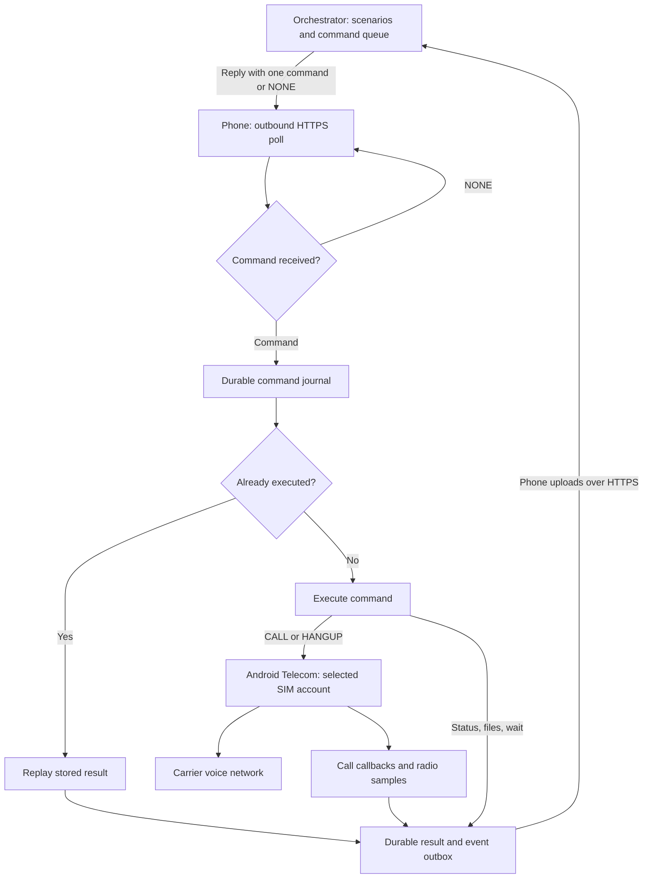

# Phase A architecture

This records the preserved Phase A control architecture. Version 0.2 adds the separate experimental audio layer described in [PHASE_B_AUDIO.md](PHASE_B_AUDIO.md).

The orchestrator owns numbers, schedules, scenarios, sequencing and retry decisions. Android executes individual commands and reports observations. Every network exchange starts on the phone; there is no inbound phone webhook, listening port, SIP client, WebRTC stack or custom `ConnectionService`.



The return edge from the orchestrator is an HTTP response to a phone request, not an inbound connection. Data connectivity for HTTPS and the carrier's native voice bearer are separate paths. The latter is selected by modem/carrier provisioning; Telecom submission alone does not prove VoLTE.

## Android responsibilities

| Package | Responsibility |
| --- | --- |
| `api` | HTTPS origin validation, enrollment, credential renewal, polling and upload acknowledgments |
| `commands` | Command journal, deduplication, parameter validation, dispatch and recovery |
| `telecom` | Select native SIM account; reserve one call; call/ hangup; observe `InCallService` callbacks |
| `telemetry` | Best-effort subscription, SIM, service, RAT, cell and signal snapshots |
| `files` | HTTPS download, host allowlist, checksum and atomic local cache storage |
| `service` | Foreground agent lifecycle, poll scheduling, connectivity recovery and backoff |
| `storage` | SQLite command/result/event persistence and settings/credentials |
| `ui` | Enrollment, permission/role setup, status, engineering controls and dialer UI |
| `logging` | Structured, credential-free diagnostics and bounded local history |

## Command lifetime and call lifetime

These are separate state machines. A `CALL` result is acknowledged once the native submission has been accepted. Events then describe the phone call over time. This keeps the ordinary command queue moving while the call runs. The reference server additionally prioritizes `HANGUP`, then status/radio inspection, so those actions can bypass an unfinished wait, download or unacknowledged call submission.

```mermaid
stateDiagram-v2
    [*] --> Received
    Received --> Replayed: Known command ID
    Received --> Reserved: Persist new CALL
    Reserved --> Failed: Validation or submission failure
    Reserved --> Submitted: Telecom accepts submission
    Submitted --> Dialing: DIALING observed
    Dialing --> Active: ACTIVE observed
    Submitted --> Disconnected: Early failure
    Dialing --> Disconnected: Rejected or unanswered
    Active --> Disconnected: Local or remote release
    Disconnected --> FinalResult: CALL_RESULT queued
    Reserved --> Uncertain: Process failure in submission window
    Submitted --> Uncertain: Call cannot be reconciled
    Uncertain --> FinalResult: Report uncertainty; no auto-redial
    Replayed --> [*]
    Failed --> [*]
    FinalResult --> [*]
```

Callback order can vary. A missing `DIALING` callback must not prevent an observed `ACTIVE` or `DISCONNECTED` from being recorded. `TelephonyManager`'s coarse `OFFHOOK` value is not proof of answer; answer timing uses Telecom `Call.STATE_ACTIVE`.

The Android agent reserves a call before submitting it. Replayed command IDs do not place another call. A crash between reservation, `placeCall` and persistence creates an ambiguous side effect: the agent reports uncertainty/reconciles a surviving call and never retries the dial automatically. Exactly-once cellular origination cannot be created from an HTTPS acknowledgment alone.

One probe call is permitted at a time. Remote `HANGUP` is limited to the call owned by the probe. Native incoming and other calls still require a usable local dialer UI, even when they are outside the orchestrated test.

## Time and radio data

Events carry UTC timestamps for correlation. Within one boot, duration calculations use monotonic elapsed time so a wall-clock correction does not distort the result. Setup time is `connected − dial request`; connected duration is `disconnect − connected`. No-answer or incomplete recovery produces absent/null measurements rather than zero-duration success.

Radio is sampled before, periodically during, and after the call within bounded storage. A snapshot distinguishes voice RAT from data RAT, carrier assignment from measured operator information, and absent values from measured zero. Cell data can be cached; record its age. A radio permission error must not turn an otherwise valid call into a call failure.

## Server and persistence

The reference server uses Python's standard library, TLS and SQLite. Operators administer the same database using a CLI; there is no remote admin API. Pending commands remain available for redelivery until an accepted terminal result or expiry. Device bearer tokens establish ownership for results/events/logs; a supplied `device_id` cannot override token identity.

Android retains pending results/events across connection loss and retries uploads with stable IDs. A server acknowledgment permits removing the corresponding outbox item. Logs are pushed through outbound HTTPS and retrieved from the server CLI. A phone unreachable through the mobile Internet needs no special NAT/firewall exception beyond outbound HTTPS.

## Milestones and next decisions

The repository covers the implementation work for enrollment/polling, calling, state/result reporting, telemetry, file management, persistence and engineering diagnostics. Hardware qualification should proceed in that order. First validate Verizon on one handset; record gaps before repeating on AT&T, T-Mobile and other Android/OEM versions.

Phase B v0.2 adds privileged PCM TX/capture attempts, diagnostics and artifact transport without changing the scenario boundary. Its device-dependent audio paths require physical validation. Audio quality scoring remains outside the agent; custom HAL/vendor modifications are not bundled.
