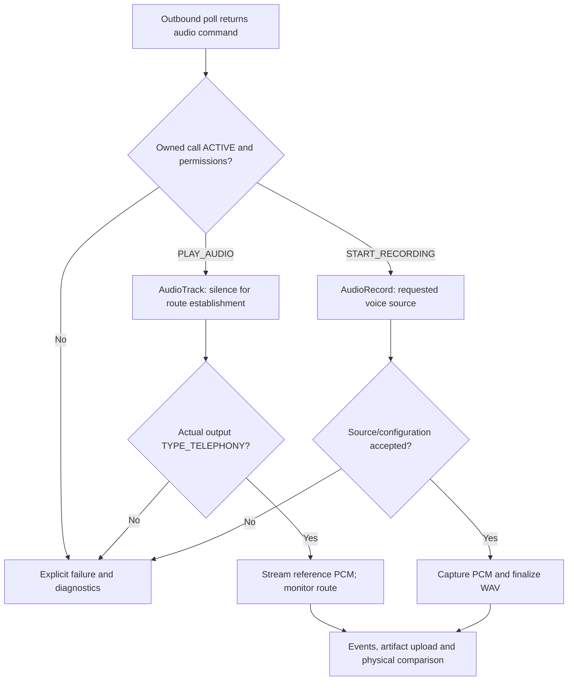

# Phase B — privileged cellular audio engineering

Version 0.2.1 extends the existing Phase A agent and v0.2.0 audio implementation. The primary hardware target is US Pixel 5 GD1YQ/redfin, stock Google Android 14 UP1A.231105.001.B2, Magisk 30.7 and a Verizon voice SIM. Start a non-rooted device with [PIXEL5_REDFIN_SETUP.md](PIXEL5_REDFIN_SETUP.md). **No handset route or far-end audio result is claimed.** Unsupported permissions, formats, routes and sources fail explicitly. Schedules, delays and scenario sequencing remain in the orchestrator.

## Evidence levels

| Observation | What it establishes | What remains unproved |
| --- | --- | --- |
| Privileged package and permissions granted | Android authorization | Vendor audio support |
| `TYPE_TELEPHONY` enumerated | A telephony device is exposed now | A particular track uses it |
| Preferred-device request accepted | Request accepted by framework | Actual route |
| Running track reports `TYPE_TELEPHONY` | Framework TX route observed | PCM reaches the modem/far end |
| Voice-source recording configuration matches and is not silenced | Framework capture source observed | File contains genuine downlink audio |
| Nonzero PCM or recognizable tone | Signal exists | Correct direction, isolation or digital transport |
| Controlled far-end capture plus microphone isolation | Physical TX evidence for this device/build/SIM | Other devices/carriers or VoLTE without bearer evidence |

Capabilities therefore use unknown/null values until the relevant evidence exists. A successful start command is an operation-start result; inspect later stopped/failed events and WAV analysis before evaluating a run.

## Implementation



TX uses `AudioTrack`, an explicitly selected telephony output, and route observation while running. Only silence is written while establishing the route; source WAV data is released after the route check. Route changes, playback errors, call termination and stop commands trigger cleanup. There is no speaker, Bluetooth, acoustic or analog fallback. Framework callbacks and route polling cannot supply a hardware-level atomic guarantee during every rerouting transition; the physical test remains required.

Reference input is RIFF/WAVE PCM16 mono at 8, 16 or 48 kHz. The original file is unchanged. TX selects stereo when device capabilities include two channels or are unspecified, explicitly duplicating mono samples into both channels; a declared mono-only output uses mono. It reports `MONO_TO_DUAL_MONO_STEREO` when applied and no sample-rate conversion. Device-wide capabilities may combine several profiles, so actual route/format checks still decide acceptance. The requested/client format does not establish the modem or carrier codec. A `sample_rate` override that disagrees with the source is rejected rather than silently resampled.

RX maps `DOWNLINK` to `VOICE_DOWNLINK`, `UPLINK` to `VOICE_UPLINK`, and `BOTH` to `VOICE_CALL`. There is no `MIC` or `VOICE_COMMUNICATION` substitution. The controller verifies recording configuration and client source, observes silencing and route information, and rejects known microphone routes. It uses the microphone foreground-service type during capture as required by the platform; that service classification does not change the selected digital voice source.

RX finalizes PCM16 mono WAVs with exact byte/frame/rate metadata. Empty, all-zero, read-error and framework-silenced recordings do not become successful signal evidence. Nonzero noise still does not prove downlink identity. Recording is bounded by a 64 MiB complete-WAV upload ceiling and a 256 MiB artifact quota. Process recovery repairs and preserves partial recordings with explicit recovery metadata instead of claiming uninterrupted capture.

TX saves the prior microphone-mute state before optionally muting and attempts restoration on stop, failure, call termination and next-process recovery. `mute_microphone` defaults to true. Device mute can affect injected audio too: a silent far end while muted is a diagnostic outcome, not evidence that the reference was routed acoustically. Repeat controlled muted/unmuted tests only to locate the mute effect; an unmuted-only success does not pass the required muted-microphone acceptance.

Use `mode:"DIGITAL_TX_VALIDATION"` for the Pixel acceptance run. It requires microphone mute and reports the requested and actual output independently, source/client format, frames, underruns and restoration. `AudioRouting.OnRoutingChangedListener` records route changes; an active non-telephony route fails with `TELEPHONY_AUDIO_ROUTE_FAILED`. A successful preferred-device request is insufficient. Normal mode remains available for separately identified engineering investigations.

## Commands

Existing endpoint, enrollment and bearer-token behavior remain as documented in [API.md](API.md). New commands use the same queue CLI and poll response:

| Action | Parameters | Meaning |
| --- | --- | --- |
| `PLAY_AUDIO` | `file_id`; optional `mode` `NORMAL` or `DIGITAL_TX_VALIDATION`, `loop` false, `mute_microphone` true, `sample_rate` | Start bounded route validation, then stream cached WAV; validation mode requires mute |
| `STOP_AUDIO` | `{}` | Stop TX and restore saved microphone state |
| `START_RECORDING` | `file_id`; optional `direction` `DOWNLINK`, `sample_rate` 16000 | Start privileged voice-source capture |
| `STOP_RECORDING` | `{}` | Stop RX, finalize artifact; terminal event may follow a STOPPING acknowledgment |
| `UPLOAD_FILE` | `file_id` | Upload finalized captured WAV to the enrolled orchestrator |
| `GET_AUDIO_STATUS` | `{}` | Current TX/RX state |
| `GET_AUDIO_DIAGNOSTICS` | `{}` or `{"probe_downlink":true}` | Passive snapshot, or explicit DOWNLINK initialization check during an ACTIVE owned call |

File IDs match `[A-Za-z0-9][A-Za-z0-9_-]{0,63}`. Capture rates are 8000, 16000 or 48000. One TX session and one RX session may operate on the single owned call; a second start cannot overwrite the active session. Stop/inspection commands can bypass unfinished ordinary work. Queue a start only after the original `CALL` reports `ACTIVE`; stop commands queued too early may run first because of that priority.

`UPLOAD_AUDIO` is a compatibility alias for `UPLOAD_FILE`. Use `DELETE_FILE {"file_id":"...","kind":"recording"}` to remove a finalized recording; omitted `kind` selects the reference cache. Active capture/upload artifacts are protected. Upload is remote-command-only because the server verifies command ownership.

Events include `AUDIO_TX_STARTING`, `AUDIO_TX_ACTIVE`, `AUDIO_TX_STOPPED`, `AUDIO_TX_FAILED`, `AUDIO_RX_RECORDING_STARTED`, `AUDIO_RX_RECORDING_STOPPED`, `AUDIO_RX_FAILED` and recovered-artifact events. The event `command_id` identifies the original `PLAY_AUDIO`/`START_RECORDING`; `data.call_command_id` identifies the owned `CALL`. `call_id` ties both operations to the same call. Final metadata includes source/hash, client format, requested/actual devices, UTC times, frame counts, underruns or capture errors and available radio context.

## Pixel runtime evidence and diagnostics access

`pixel5_audio_capability_dump.sh` preserves separate vendor policy, mixer and platform XML files with original paths and matching device/local SHA-256. The installed phone's evidence governs this run. `verify_audio_privileges.sh --probe-downlink` requires fresh, same-call initialization evidence; unknown, stale or unrelated evidence prints `FAIL_NOT_TESTED`. Initializing `VOICE_DOWNLINK` does not start recording and does not prove downlink PCM. A verified existing DOWNLINK session can supply initialization evidence without opening a competing recorder.

The local engineering bridge is protected by `android.permission.DUMP` and an explicit shell/root UID check:

```bash
adb shell content call --uri content://com.sinch.vqprobe.diagnostics --method snapshot
adb shell content call --uri content://com.sinch.vqprobe.diagnostics --method probe_downlink
```

The second command explicitly requests the initialization check. The response is a Bundle containing `json`; evidence scripts preserve both the raw response and parsed JSON. It includes app/build identity, diagnostics, call result, TX/RX state and recording metadata. There is no world-readable diagnostics-file fallback. `collect_pixel5_phaseb_evidence.sh` combines this with phone dumps and optional server WAV evidence. See [physical acceptance](AUDIO_ACCEPTANCE_TEST.md) for commands and interpretation.

## Artifact transport

After capture finishes, `UPLOAD_FILE` sends the WAV using:

```text
POST /api/v1/probe/artifacts/<upload_command_id>
Authorization: Bearer <device access token>
X-Device-ID: <enrolled ID>
X-File-ID: <file_id>
X-SHA256: <64 lowercase hex characters>
Content-Type: audio/wav
Content-Length: <exact complete WAV bytes, at most 64 MiB>
```

The server requires a delivered, owned `UPLOAD_FILE` command with the matching file ID. It streams into a temporary file, verifies hash/WAV integrity, and publishes atomically. An identical replay returns the same artifact metadata; a changed replay conflicts. Arbitrary upload paths and another device's commands are rejected.

Queue uploads with `--ttl-seconds 600` or a longer measured allowance; a new transfer must finish within its command TTL. Identical replay of an already accepted artifact remains idempotent after TTL expiry. Media endpoints return `SHA256_MISMATCH` for a bad digest and `INVALID_PCM_WAV` for malformed/unsupported content; keep a failed artifact for investigation instead of relabeling it successful.

```bash
python3 -m orchestrator.server --db probe.db artifacts --device-id DEVICE_ID --limit 100
```

The CLI returns metadata and the local server path; there is no unauthenticated media-download endpoint. `serve --artifact-dir /absolute/path` chooses storage; the default is a directory beside the database named from its stem, such as `probe-artifacts`. The API server does not serve reference downloads; use your existing trusted HTTPS media host for those.

## Why the built-in path is worth testing

AOSP's redfin policy contains `incall_music_uplink` routed to `Telephony Tx`, with PCM16 rates 8000/16000/48000 and a stereo output profile; it also declares `voice_rx` from `Telephony Rx`. This is concrete source evidence for investigating Pixel 5/redfin, not proof that a particular installed vendor image exposes the route to this APK. Read the handset's active policy and dumpsys output. [Redfin policy source](https://android.googlesource.com/device/google/redfin/+/refs/heads/main/audio/audio_policy_configuration.xml).

AOSP `AudioPolicyManager` can add `AUDIO_OUTPUT_FLAG_INCALL_MUSIC` for explicitly selected telephony TX, linear PCM, suitable usage and accessible call audio. The application uses public routing APIs and leaves internal flag selection to policy; it does not set hidden flags through reflection. [Policy implementation, pinned revision](https://android.googlesource.com/platform/frameworks/av/+/8bcdf2fa7e77db730de624db3dcb7c6e9161260f/services/audiopolicy/managerdefault/AudioPolicyManager.cpp).

Qualcomm examples are not interchangeable with the shipping Pixel HAL. An older AOSP Qualcomm extension handles in-call music around local-hold voice sessions, and its voice module delegates mute to platform code. These are reasons to inspect the installed HAL and measure mute behavior, not to assume active VoLTE compatibility. [Qualcomm extension](https://android.googlesource.com/platform/hardware/qcom/audio/+/ac2e19562a97492f658a4d6bb997d96d4952bfb7/hal/voice_extn/voice_extn.c), [voice and mute implementation](https://android.googlesource.com/platform/hardware/qcom/audio/+/ac2e19562a97492f658a4d6bb997d96d4952bfb7/hal/voice.c).

Public documentation also distinguishes preferred from routed devices and reserves voice-call capture sources for privileged access. [AudioTrack](https://developer.android.com/reference/android/media/AudioTrack), [voice audio sources](https://developer.android.com/reference/android/media/MediaRecorder.AudioSource), [AudioRecord](https://developer.android.com/reference/android/media/AudioRecord).

## Engineering release boundary

No custom HAL, vendor mixer edits, SELinux policy relaxation or modem/IMS replacement is included. Device preparation is an explicit manual [Pixel runbook](PIXEL5_REDFIN_SETUP.md); scripts never unlock, wipe, root or flash automatically. If the built-in route fails, follow [the ordered investigation](AUDIO_TROUBLESHOOTING.md) and isolate any justified device-specific change. See [module installation](PRIVILEGED_INSTALL.md) and [physical acceptance](AUDIO_ACCEPTANCE_TEST.md).
